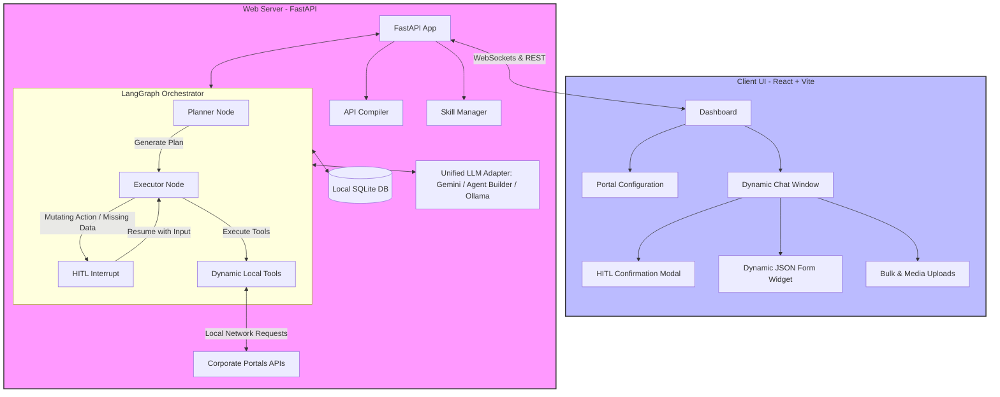
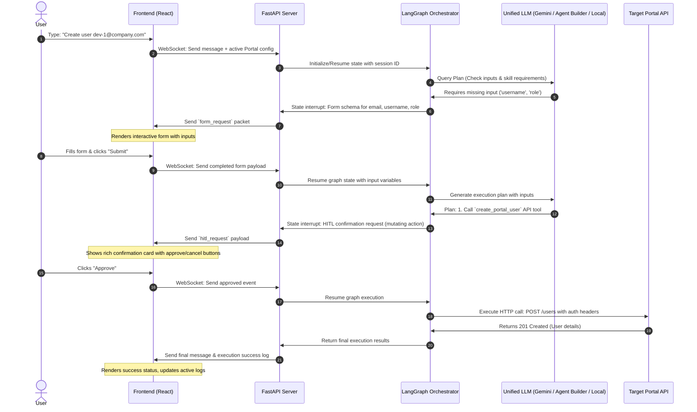

# Generic Portal Control Agent: Architecture & Implementation Plan

This document outlines the detailed architecture and implementation plan for building a **Generic Portal Control Agent**. The system is designed to run entirely offline, with zero external or paid dependencies, utilizing LangGraph, FastAPI, and React. It empowers corporate teams to control complex portal interfaces and execute workflows via a unified chat interface with advanced features like:

1. **Dynamic OpenAPI Tool Ingestion**: Generates executable LangChain tools from Swagger/OpenAPI specifications.
2. **YAML-based Project Skills**: A declarative schema for defining UI flows, sequential dependencies (e.g., "click A, then B"), rules, and custom workflow logic.
3. **Advanced Interactivity**: Support for dynamic UI forms, file uploads (for bulk actions), progress trackers, and real-time execution steps directly within the chat.
4. **Human-in-the-Loop (HITL)**: Mandatory confirmation workflows for state-modifying or destructive API calls.
5. **Local-First Design**: Completely offline-capable, using local package dependencies and supporting local LLM runtimes (e.g., Ollama or a custom local OpenAI-compatible server).

---

## User Review & Dynamic Adaptations

Based on user review and architectural alignment, the following strategies have been integrated:

### 1. Unified LLM Integration Strategy
The agent's LLM engine is completely provider-agnostic. We support three primary configurations via environment variables (`.env`) or a UI settings interface:
- **Gemini API**: Accessible via `langchain-google-genai` using a Gemini API key.
- **OpenAI-Compatible Providers**: Integrates with local inference servers (Ollama, Llama.cpp, vLLM).
- **Corporate Agent Builder**: Connects directly to your internal corporate platform using its specific Base URL, API key, and target model identifiers.

### 2. Secret & Configuration Storage
For ease of setup and corporate security bounds, portal authorization tokens, endpoints, API keys, and target URLs are stored locally:
- Stored securely in a local `.env` configuration file alongside the project.
- Cached locally in an offline SQLite database for dynamic session-level modifications.
- Provided a clean UI configuration panel to enter, view, and save these settings locally without cloud leaks.

### 3. Rich Bulk Data & Multimedia Inputs
Our upload module accommodates diverse operations:
- **Bulk Data Files**: Support for **CSV**, **JSON**, and **Excel (`.xlsx`)** spreadsheets parsed via local python dependencies (`openpyxl`).
- **Multimedia Uploads**: Ability to attach **images** and **videos** required by specific portal actions.
- **Local Storage Pipeline**: Uploaded files are streamed to `/backend/uploads/` on the server and their local paths or file-buffers are passed directly as arguments to the dynamically generated tools.

### 4. Fully Isolated & Reusable Directory Architecture
The workspace is split into isolated modules:
- `/frontend`: Independent React React + Vite + Vanilla CSS application.
- `/backend`: Independent FastAPI Python server.
- `/backend/venv`: Isolated Python virtual environment to manage dependencies locally.
- `/docs`: Unified user manuals, skill format schemas, and dynamic tool instructions.
- `/context`: Time-stamped history logs, planning artifacts, and design notes so that project context is fully preserved when transferring files to any new development machine.

---

## Proposed System Architecture



---

## Proposed Schema Definitions

### 1. Project Skill Schema (`project_skill.yaml`)
This schema specifies the metadata, sequential steps, conditions, dynamic input requirements, and safety policies of a custom portal skill.

```yaml
id: create_user_workflow
name: "Create Portal User with Team Assignment"
description: "Sequential guidelines to register a user, verify their team, and perform role binding."
version: "1.0.0"

# High-level safety controls
safety_policy:
  require_confirmation_for_mutations: true

# The flow of steps that guides the Planner and Executor
steps:
  - step: 1
    id: check_team_existence
    description: "Check if the requested department/team exists."
    action_type: "api_call"
    tool_name: "get_team_by_name"
    inputs:
      name: "{{team_name}}"
    on_failure:
      action: "interrupt"
      message: "The team '{{team_name}}' does not exist. Do you want to create it first?"

  - step: 2
    id: gather_user_parameters
    description: "Collect user registration parameters from the operator."
    action_type: "collect_input"
    input_fields:
      - name: "email"
        type: "string"
        required: true
        description: "Corporate email address"
      - name: "username"
        type: "string"
        required: true
        description: "Unique system username"
      - name: "role"
        type: "string"
        required: true
        options: ["Administrator", "Developer", "Operator"]
        description: "System permission role"

  - step: 3
    id: execute_user_creation
    description: "Call the create user API tool with verified details."
    action_type: "api_call"
    tool_name: "create_portal_user"
    inputs:
      email: "{{email}}"
      username: "{{username}}"
      role: "{{role}}"
    requires_approval: true # Force human-in-the-loop card
```

### 2. State & Messaging Schema
To allow the UI to render rich, interactive components instead of raw text, the API messages will include a `type` payload:
- `text`: Standard chat messages from the user or agent.
- `status_update`: Execution status messages (e.g., "Step 1/3: Checking team existence...").
- `form_request`: Form schemas (JSON schema) representing parameters the user needs to fill.
- `hitl_request`: Confirmation cards containing the planned action details, destructive warnings, and Approve/Reject controls.
- `progress_bar`: Progress counters for multi-step or bulk operations.

---

## Detailed Directory & File Structure

Here is the exact structure we will create in the `e:\2026\May\AI_Bot` workspace:

### 1. Backend (`/backend`)
Contains the FastAPI server, LangGraph definition, database models, and the compilers for skills and Swagger docs.

* **[NEW] [requirements.txt](file:///e:/2026/May/AI_Bot/backend/requirements.txt)**: Core dependencies.
  ```text
  fastapi==0.110.0
  uvicorn==0.28.0
  langgraph==0.0.32
  langchain==0.1.13
  langchain-openai==0.1.1
  langchain-google-genai==1.0.1
  google-generativeai==0.4.0
  pydantic==2.6.4
  pyyaml==6.0.1
  python-multipart==0.0.9
  httpx==0.27.0
  openpyxl==3.1.2
  python-dotenv==1.0.1
  ```
* **[NEW] [main.py](file:///e:/2026/May/AI_Bot/backend/app/main.py)**: Initializes FastAPI, loads WebSocket endpoints for live chat streaming, and exposes REST endpoints for portal, Swagger, and skill uploads.
* **[NEW] [config.py](file:///e:/2026/May/AI_Bot/backend/app/config.py)**: Holds environmental variables (e.g., LLM choice, credentials, uploads path).
* **[NEW] [database.py](file:///e:/2026/May/AI_Bot/backend/app/database.py)**: Sets up SQLite tables to persist active configurations.
* **[NEW] [api_compiler.py](file:///e:/2026/May/AI_Bot/backend/app/agents/api_compiler.py)**: Parses OpenAPI schemas, compiles tools, and dynamically tags state modifications.
* **[NEW] [skill_manager.py](file:///e:/2026/May/AI_Bot/backend/app/agents/skill_manager.py)**: YAML compilation and lookup core.
* **[NEW] [state.py](file:///e:/2026/May/AI_Bot/backend/app/agents/state.py)**: Dynamic LangGraph State structure.
* **[NEW] [planner.py](file:///e:/2026/May/AI_Bot/backend/app/agents/planner.py)**: Master plan coordinator.
* **[NEW] [executor.py](file:///e:/2026/May/AI_Bot/backend/app/agents/executor.py)**: Action runner with HITL hooks.
* **[NEW] [graph.py](file:///e:/2026/May/AI_Bot/backend/app/agents/graph.py)**: Compiled LangGraph state machine.

### 2. Frontend (`/frontend`)
Contains the gorgeous, interactive dashboard UI designed to feel premium, featuring glassmorphism, tailored HSL color palettes, custom responsive CSS layouts, and live micro-animations.

* **[NEW] [vite.config.js](file:///e:/2026/May/AI_Bot/frontend/vite.config.js)**: Configures Vite, alias paths, and proxy options.
* **[NEW] [index.css](file:///e:/2026/May/AI_Bot/frontend/src/index.css)**: Implements the premium color tokens (sleek deep dark mode background, neon violet/cyan gradients, smooth transitions).
* **[NEW] [App.jsx](file:///e:/2026/May/AI_Bot/frontend/src/App.jsx)**: Main dashboard page that hosts:
  - **Portal Configuration Panel**: Quick portal switching, input fields for Swagger files, dynamic auth header fields, and YAML skills viewer.
  - **Unified Chat Workspace**: Smooth scrollable messaging console.
  - **Dynamic Interactive Overlay**: Slides out forms and confirmation cards when the agent interrupts the flow.
* **[NEW] [DynamicForm.jsx](file:///e:/2026/May/AI_Bot/frontend/src/components/DynamicForm.jsx)**: A highly reusable form component that translates a JSON Schema (sent from Pydantic) into a premium UI form.
* **[NEW] [ConfirmationCard.jsx](file:///e:/2026/May/AI_Bot/frontend/src/components/ConfirmationCard.jsx)**: Custom visual cards for HITL verification, detailing proposed request bodies, headers, path variables, and risk level, with "Approve" and "Cancel" buttons.
* **[NEW] [FileUploader.jsx](file:///e:/2026/May/AI_Bot/frontend/src/components/FileUploader.jsx)**: A drag-and-drop element supporting bulk operation file uploads, rendering a tabular preview of parsed data for user verification.

---

## Dynamic Flow & Human-in-the-Loop Sequence

The diagram below details the sequence of a typical flow where a user asks to perform a mutating action:



---

## Verification & Testing Plan

To ensure the system works reliably completely offline and is highly reusable, we will implement the following verification mechanisms:

### 1. Mock Portal Suite
We will create a small mock HTTP API suite inside `/backend/mock_portal` (running on a secondary port e.g., `8081`). This mock suite will host a simple CRUD API for "Teams" and "Users", along with its own OpenAPI `swagger.json` document. This allows local, offline testing of:
- Uploading a spec and generating dynamic client tools.
- Single and bulk insertions.
- Validating that headers (like bearer tokens) are passed correctly.

### 2. Automated Backend Tests
- Pytest scripts in `/backend/tests/` to verify:
  1. OpenAPI parser extracts endpoints, path variables, query parameters, and bodies properly.
  2. YAML compiler correctly reads and validates skill formats.
  3. Dynamic tool invocations return structured outputs.
  4. LangGraph interrupts correctly when mutation tools are executed or when required variables are absent.

### 3. Manual UI Verification
- Uploading custom `swagger.json` and a custom workflow YAML file.
- Asking the chat to perform actions and verifying that forms and HITL cards slide in and behave responsively.
- Performing a bulk operations test by uploading a custom CSV file to ensure data is parsed, verified, and mapped correctly to API tools.

---
**Next Step**: Please review this architectural layout and provide your feedback. Once approved, we will immediately set up the backend framework and directory structure, implement the core schemas, and begin building the OpenAPI compiler and skill managers.
