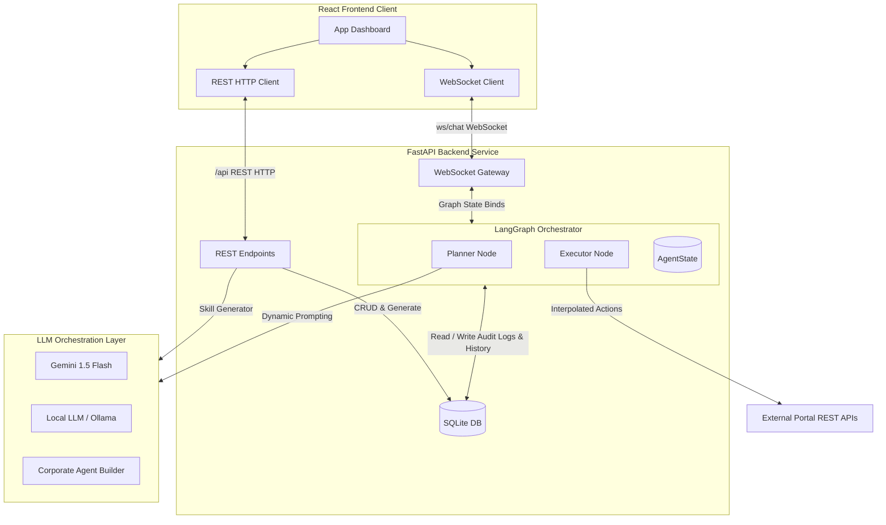

# Getting Started: Operational Agent Dashboard

This guide describes how to run and test the Unified Portal Control Agent system locally. Follow these steps to spin up the FastAPI servers, compile the React workspace, and execute your first operational workflow with manual approvals.

---

## 1. Prerequisites

Ensure you have the following installed locally:
* **Python 3.10+** (tested on Python 3.11)
* **Node.js 18+** & **npm**

---

## 2. Booting the Backend Subsystems

We have integrated an isolated Python virtual environment (`venv`) and a concurrent runner `run.py` to make execution trivial.

1. Open a terminal and navigate to the `/backend` folder:
   ```powershell
   cd backend
   ```
2. Activate the virtual environment:
   ```powershell
   .\venv\Scripts\Activate.ps1
   ```
3. Boot both the **Mock Portal Server** (port 8081) and the **Main Agent WebSocket Server** (port 8000) concurrently:
   ```powershell
   python run.py
   ```
   * *The Mock Portal serves a local CRUD API mimicking your corporate portals at `http://127.0.0.1:8081`.*
   * *The main orchestrator serves WebSocket and REST bridges at `http://127.0.0.1:8000`.*

---

## 3. Booting the React Client Dashboard

1. Open a new terminal window and navigate to the frontend workspace:
   ```powershell
   cd frontend
   ```
2. Install local npm dependencies (React, ReactDOM, Lucide React, Vite):
   ```powershell
   npm install
   ```
3. Boot the Vite hot-reloading development server:
   ```powershell
   npm run dev
   ```
4. Open your browser and navigate to the dashboard:
   **[http://localhost:3000](http://localhost:3000)**

---

## 4. Step-by-Step Integration Verification Walkthrough

Once both applications are running, execute the following workflow to test the dynamic compilers, compilers, forms, and Human-in-the-Loop gates:

### Step A: Configure the Portal Connection
1. In the left panel of the browser dashboard, click **"Add Portal"**.
2. Fill out the form with the following details:
   * **Portal Nickname ID**: `mock-admin`
   * **Display Title**: `Corporate Admin Portal`
   * **Base Target API URL**: `http://127.0.0.1:8081`
   * **Authentication Headers**:
     * Key: `Authorization`
     * Value: `Bearer mock-secret-bearer-key`
3. Retrieve the raw OpenAPI Swagger document from the running Mock Portal. In a new tab, open:
   `http://127.0.0.1:8081/openapi.json`
4. Copy the entire raw JSON text and paste it into the **OpenAPI Swagger Spec** textarea.
5. Click **"Register"**.

---

### Step B: Teach the Portal a Skill Workflow
1. Select the newly registered `Corporate Admin Portal` in your sidebar list.
2. Under "Uploaded Portal Skills", click **"Teach Portal a Skill (.yaml)"**.
3. Choose or drag the sample skill YAML template below. Save this text locally as `create_user.yaml` before uploading:
   ```yaml
   id: mock_create_user
   name: "Corporate User Enlistment"
   description: "Guideline steps to create a new user profile on the Admin dashboard."
   version: "1.0.0"
   steps:
     - step: 1
       id: gather_inputs
       action_type: "collect_input"
       input_fields:
         - name: "email"
           type: "string"
           required: true
           description: "User corporate email"
         - name: "username"
           type: "string"
           required: true
           description: "Unique account username"
         - name: "role"
           type: "string"
           required: true
           options: ["Administrator", "Developer", "Guest"]
           description: "Assigned access role"
     - step: 2
       id: execute_creation
       action_type: "api_call"
       tool_name: "create_user"
       inputs:
         email: "{{email}}"
         username: "{{username}}"
         role: "{{role}}"
         team_name: "Engineering"
       requires_approval: true
   ```
4. Verify that the skill registers successfully and displays in the list!

---

### Step C: Execute Chat Operation & HITL Approvals
1. In the chat input, type: **`Execute user enlistment workflow`** and hit Send.
2. The Planner node will dynamically match your request to the `mock_create_user` skill and compile the 2-step plan, displaying it in the right checklist tracker.
3. The Executor node will check Step 1 (`gather_inputs`). Since email, username, and role are not present in variables, it halts execution and **opens a sleek form card** directly in the chat panel!
4. Fill in the form fields (e.g. `operator-1@company.com`, `ops_lead`, select `Administrator` role) and click **"Submit Details"**.
5. The graph resumes, saves variables, and starts Step 2 (`execute_creation`).
6. Because `requires_approval` is set to `true`, execution pauses again. **A glowing Security Authorization Card slides into view**, detailing:
   * Target URL base and authorization headers validation.
   * JSON payload inputs mapping.
7. Click **"Authorize & Execute"**.
8. The graph resumes, triggers the live REST request to `http://127.0.0.1:8081/users`, and receives the confirmation response.
9. Watch the stepper marks go **completed (green check)**, and the agent post the final successful creation response message in chat!

---

## 5. Advanced: Batch & Loop Operations

Our platform natively supports dynamic bulk iteration logic (e.g. executing workflows multiple times in parallel/sequential runs).

### Step D: Triggering a Bulk Loop Run
1. In the chat prompt, type: **`Create 5 users`** or **`Batch register 3 users: operator-1@company.com and operator-2@company.com`**.
2. Notice that the **Dynamic LLM Planner** is instantly invoked (never bypassed!). It parses your intent, extracts quantities (e.g., 5), pre-populates variables that were in the query (like emails), and builds a loop-configured stepper checklist marked with `🔄 LOOP MODE (5 Items)`.
3. **Unified Loop Form**: Step 1 (`gather_inputs`) halts and displays a paginated card slider directly inside the chat workspace letting you enter details for "Item 1 of 5", "Item 2 of 5", etc. completely on a single screen!
4. **One-Click Batch Authorization**: Step 2 (`execute_creation`) halts and displays a unified authorization grid listing the target parameters of all 5 iterations. Review the batch variables and click **"Authorize Batch Run"** to approve all 5 API mutations in a single operation!
5. **Real-time Metrics & Fault Tolerance**:
   * During execution, a dynamic percentage bar shows progress (e.g. `Processing Loop Index... 3 of 5 (60%)`) in real time.
   * If any specific user creation API fails (e.g. user 3 is duplicates), the executor automatically registers the failure in details, continues the loop to create subsequent users (4 and 5), and displays a detailed success/error breakdown tally badge upon step completion!
   * Expand the **⚡ Agent Mind Timeline** to inspect the real-time granular cognitive thought logs of the running agent.

---

## 6. System Architecture & Communication Flows

This section details the underlying architectural layers, communication protocols, and SQLite schema that power the Unified Portal Control Agent.

### System Architecture Overview



The system is split into three main operational components:
1. **React Frontend**: A highly responsive visual workspace featuring a Portal configuration manager, a Skill YAML designer, an interactive real-time Chat view, and a dynamic sidebar displaying execution logs and the **⚡ Agent Mind Timeline**.
2. **FastAPI Backend (LangGraph state engine)**: Orchestrates conversational interactions, parses OpenAPI schemas, registers skills, manages session persistence, and runs a state-machine graph (`StateGraph`) consisting of a `plan` node and an `execute` node.
3. **LLM Orchestration Layer**: Supports multiple providers (`gemini`, `openai` for local Ollama, and `agent_builder`) to dynamically generate execution plan checklists and synthesize raw skill YAML definitions.

---

### End-to-End Communication Protocols

#### A. Frontend-Backend REST & WebSocket Interfaces
Communication between the frontend dashboard and backend orchestrator is split between real-time bidirectional WebSockets and static CRUD REST endpoints.

```
       +------------------+                   +--------------------+
       |  React Frontend  |                   |   FastAPI Backend  |
       +------------------+                   +--------------------+
                |                                       |
                |======== WS Connect (/ws/chat) =======>| [Accept & Restore]
                |<======= Event: 'restore' =============| (Loads past messages/logs)
                |                                       |
                |-------- REST HTTP (File Upload) ----->| [Save file to disk]
                |<------- Response (saved_path) --------|
                |                                       |
                |======== Message: 'chat' =============>| [Planner Node (LLM)]
                |        (text, file_path, provider)    |
                |<======= Event: 'logs' ================| [Stream cognitive logs]
                |                                       |
                |<======= Event: 'interrupt' ===========| [Pause: HITL / Collect Input]
                |        (renders dynamic form/card)    |
                |                                       |
                |======== Message: 'form_submit' =======>| [Resume LangGraph]
                |        (user parameters payload)      |
                |<======= Event: 'logs' ================| [Stream API execution logs]
                |                                       |
                |<======= Event: 'completion' ==========| [Workflow completed]
                |                                       |
```

##### 1. WebSocket Commands (Client to Server)
The WebSocket gateway at `/ws/chat` accepts JSON payloads with the following command structures:
* **`restore`**: Triggered when switching sessions or opening the client.
  ```json
  { "type": "restore", "portal_id": "mock-admin", "session_id": "session-123", "model_provider": "gemini" }
  ```
* **`chat`**: Sends a conversational prompt to the orchestrator, optionally attaching a path to an uploaded file.
  ```json
  { "type": "chat", "portal_id": "mock-admin", "text": "Batch create 3 users", "session_id": "session-123", "model_provider": "gemini", "file_path": "backend/uploads/8f3b_users.csv" }
  ```
* **`form_submit`**: Submits variables gathered via a dynamic form card or approves a proposed runbook checklist.
  ```json
  { "type": "form_submit", "portal_id": "mock-admin", "session_id": "session-123", "variables": { "role": "Developer" }, "parameter_list": [ { "email": "a@b.com" } ], "is_plan_approval": true }
  ```
* **`hitl_response`**: Explicitly authorizes or rejects an API mutation or manual checkbox runbook step.
  ```json
  { "type": "hitl_response", "portal_id": "mock-admin", "session_id": "session-123", "step_id": "execute_creation", "approved": true }
  ```

##### 2. WebSocket Events (Server to Client)
The backend streams real-time updates back to the client:
* **`restore`**: Carries complete message history, plan step arrays, and compliance logs back to the React shell.
* **`logs`**: Streams incremental text logs representing the agent's real-time reasoning and operational actions.
* **`interrupt`**: Halts client flow to render interactive overrides (e.g. form fields for `collect_input` or a security authorization panel for `api_call`).
* **`completion`**: Indicates successful conclusion of the runbook, carrying the final human-readable response text.
* **`error`**: Streams execution-time failures, OpenAPI parameters mismatch, or network connection timeouts.

##### 3. REST API Routes
* `POST /api/portals`: Registers a new target portal configuration, base URL, auth headers, and OpenAPI JSON spec.
* `GET /api/portals` / `DELETE /api/portals/{portal_id}`: Lists or deletes registered portal profiles.
* `POST /api/skills`: Compiles and registers a declarative YAML skill runbook, validating its step structure using a strict parser.
* `GET /api/skills` / `DELETE /api/skills/{skill_id}`: Lists or deletes active skills associated with a portal.
* `POST /api/skills/generate`: Dynamic Skill Generator interface. Analyzes OpenAPI schemas and prompts the LLM to output a compliant YAML skill blueprint based on plain-text guidelines.
* `POST /api/sessions` / `GET /api/sessions` / `DELETE /api/sessions/{session_id}`: Saves, lists, or cleans up persistent operational session histories.
* `POST /api/upload`: Receives multi-part file uploads (JSON, CSV, XLSX, media) and saves them in `backend/uploads/` returning their server-side file paths.

---

#### B. Backend-LLM Orchestration Layer
The main agent orchestrator incorporates two dedicated LLM pipelines:

1. **Dynamic runbook compilation (`planner.py`)**:
   When the user sends a `chat` message, the orchestrator triggers the `plan_node` LangGraph step. The backend compiles:
   * Conversational history context.
   * The list of registered pre-defined skills associated with the active portal.
   * Dynamic OpenAPI specifications (paths, operations, parameters) compiled into tool signatures.
   
   It formats this contextual prompt and invokes the chosen LLM provider (`Gemini 1.5 Flash` by default) to generate a sequential JSON-formatted plan checklist. If a pre-defined skill matches the query intent (e.g. "user creation"), the LLM copies the YAML's step structure. If not, it leverages the Swagger schema to build custom API calls on the fly.

2. **Skill Generation API (`skill_generator.py`)**:
   Under the "Skill Studio" interface, developers can input an operational description. The backend reads the target portal's OpenAPI Swagger document, filters its paths to avoid context overflow, and asks the LLM to draft a complete, syntactically correct YAML document matching our declarative schema. It handles optional variables binding, conditional parameter guidelines, and safety enforcement cards.

---

### Database Architecture & SQLite Schema

A SQLite database (`app/storage/portal_agent.db`) is provisioned at startup to support relational persistence, historical audits, and state restoration.

```
       +------------------+
       |     portals      |
       +------------------+
       | id (PK, TEXT)    | <----+
       | name (TEXT)      |      |
       | base_url (TEXT)  |      |
       | headers (TEXT)   |      |
       | swagger_doc (TXT)|      |
       | created_at (TEXT)|      |
       +------------------+      |
                                 |
       +------------------+      |
       |      skills      |      |
       +------------------+      |
       | id (PK, TEXT)    |      |
       | portal_id (FK)   |------+ (ON DELETE CASCADE)
       | name (TEXT)      |      |
       | description (TXT)|      |
       | yaml_content(TXT)|      |
       | created_at (TEXT)|      |
       +------------------+      |
                                 |
       +------------------+      |
       |     sessions     |      |
       +------------------+      |
       | id (PK, TEXT)    |      |
       | portal_id (FK)   |------+ (ON DELETE CASCADE)
       | title (TEXT)     |      |
       | created_at (TEXT)|      |
       +------------------+      |
                ^                |
                |                |
                +--------+-------+
                |        |
    (ON DELETE CASCADE)  | (ON DELETE CASCADE)
                |        |
    +------------------+ | +------------------+
    | session_messages | | |session_audit_logs|
    +------------------+ | +------------------+
    | id (PK, INT AUTO)| | | id (PK, INT AUTO)|
    | session_id (FK)  |-+ | session_id (FK)  |
    | sender (TEXT)    |   | log_text (TEXT)  |
    | text (TEXT)      |   | created_at (TEXT)|
    | created_at (TEXT)|   +------------------+
    +------------------+
```

1. **`portals`**: Stores corporate portal profiles. The request headers dictionary is serialized as a JSON string for SQLite storage.
2. **`skills`**: Contains declarative YAML skill runbooks linked to their target portal via foreign key constraint (`portal_id`).
3. **`sessions`**: Represents distinct interactive chat runs. Each session is bound to a single portal.
4. **`session_messages`**: Saves user prompts and final agent completion text sequences, ensuring chat history persists across refreshes.
5. **`session_audit_logs`**: Tracks compliance audit trails and real-time execution steps, feeding the client's cognitive mind timeline component upon reload.


